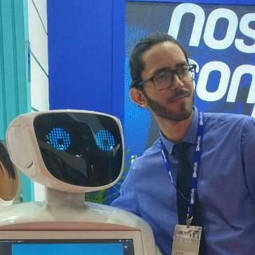

# Team

## ~~Vinicius Moreira~~

Com pé no gelo e termogênico, fez as primeiras versões do portal da Nodis em tempo recorde.

## ~~Jaime Marques~~

Desenvolvedor da Stone que através de freelas para a Nodis fez as primeiras versões do aplicativo da Nodis.

## Yuri Azevedo

|                      Foto                      | Descrição                                                                                                                                                                                                                                                                                                                                                                            |
| :--------------------------------------------: | ------------------------------------------------------------------------------------------------------------------------------------------------------------------------------------------------------------------------------------------------------------------------------------------------------------------------------------------------------------------------------------ |
|  | Expo killer (diminuiu o tamanho do app iOS de 54MB para 7MB com isso), samurai do amor e reestruturador do aplicativo. Com seu rápido aprendizado, não demorou a trazer as melhores práticas para todos os projetos do time. Sempre defensor para que as coisas sejam feitas da melhor maneira possível. Através de cursos, podcasts e palestras está sempre se mantendo atualizado. |

## [~~Thiago Oliveira~~](https://tnogueira.dev)

|                         Foto                         | Descrição                                                                                                                                                                                                                                                                                                                                                            |
| :--------------------------------------------------: | -------------------------------------------------------------------------------------------------------------------------------------------------------------------------------------------------------------------------------------------------------------------------------------------------------------------------------------------------------------------- |
|  | Inconformado com código ruim e sonhador que imaginou o [Frontend Universe](https://nodis-com-br.github.io/math/projects-naming-references). Além de dar nomes legais aos projetos, também trouxe o [Typescript](https://nodis-com-br.github.io/math/typescript) para o time e ajudou na criação da [nova arquitetura](https://nodis-com-br.github.io/math/universe). |

[< Go back](https://nodis-com-br.github.io/math/)
